# AI-Assistant-Demo

企业级 AI 智能问答与知识管理系统 — 集对话、知识库检索、文档管理、权限隔离于一体的全栈应用Demo。

> **注意**：本项目当前针对 Qwen3.5-9B 进行了针对性开发，Prompt 工程、Tool Calling 解析、流式输出处理等均围绕该模型适配，尚未做通用的 LLM 兼容层。如需接入其他模型，需要自行调整提示词模板和工具调用解析逻辑。

## 技术栈

| 层级 | 技术 | 说明 |
|------|------|------|
| 前端 | React 19 + TypeScript + Tailwind CSS | Ant Design 组件 + Zustand 状态管理 + SSE 流式渲染 |
| 后端 | Django 6 + Django REST Framework | JWT 认证、RBAC 权限、MinIO 文件管理、MySQL 持久化 |
| AI 服务 | FastAPI + LangGraph + Qwen3.5 | Agent 推理、SSE 流式对话、知识库索引、Celery 异步任务 |
| 基础设施 | MySQL · Redis · Elasticsearch · MinIO | 通过 Docker Compose 一键启动 |

## 功能特性

- **智能对话** — SSE 流式响应，支持查询改写、思考过程展示、工具调用可视化、上下文记忆
- **知识库管理** — 文档上传（PDF/DOCX）、Parent-Child 分块、Elasticsearch 全文检索、分块编辑
- **文档处理流水线** — Parser → Chunker → Enhancer → Vectorizer → Storage 五层管道，Celery 异步执行
- **PPT 生成** — LLM 规划内容 → python-pptx 渲染多主题幻灯片 → MinIO 存储 → 前端下载
- **权限隔离** — 三级角色（sys_admin / dept_admin / user），知识库显式授权，部门数据隔离
- **反馈系统** — 点赞/点踩 + 原因标签 + 文本反馈详情，管理员反馈看板
- **标签体系** — 二级标签树管理，文档关联分类，AI Service 动态拉取标签注册表
- **AI 记忆** — 异步事实抽取（偏好/知识/目标/上下文），对话时自动注入高置信度记忆
- **深色模式** — 完整的亮/暗/跟随系统主题切换
- **会话管理** — 分组、置顶、搜索、导出（PDF/Word/TXT）

## 系统截图

<table>
  <tr>
    <td align="center"><b>登录</b></td>
    <td align="center"><b>欢迎页</b></td>
  </tr>
  <tr>
    <td>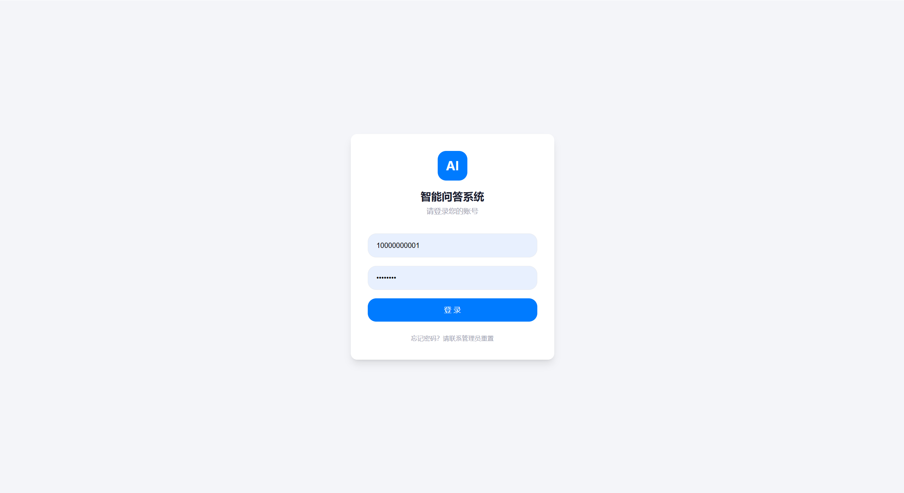</td>
    <td>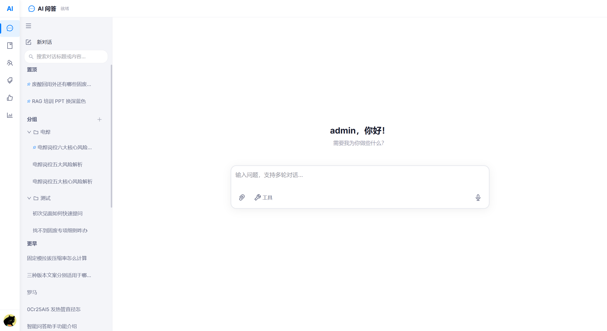</td>
  </tr>
  <tr>
    <td align="center" colspan="2"><b>智能对话</b></td>
  </tr>
  <tr>
    <td colspan="2">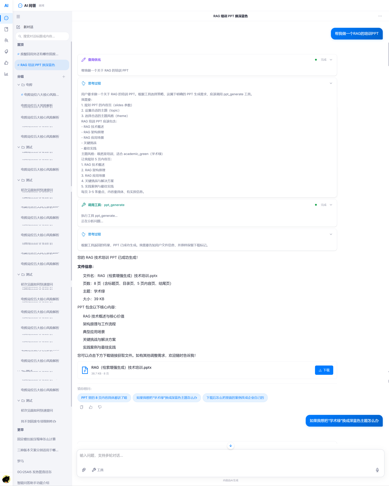</td>
  </tr>
  <tr>
    <td align="center"><b>知识库管理</b></td>
    <td align="center"><b>文档分块编辑</b></td>
  </tr>
  <tr>
    <td>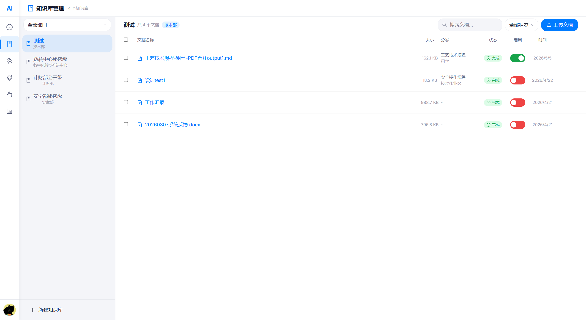</td>
    <td>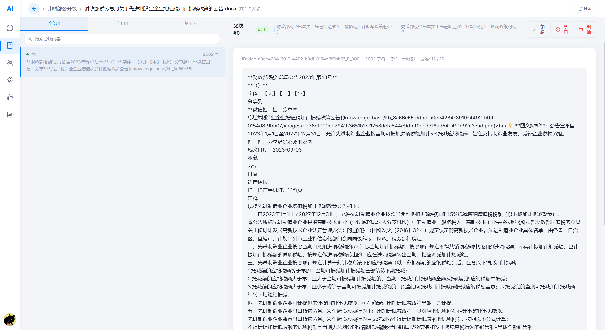</td>
  </tr>
  <tr>
    <td align="center"><b>标签管理</b></td>
    <td align="center"><b>用户管理</b></td>
  </tr>
  <tr>
    <td>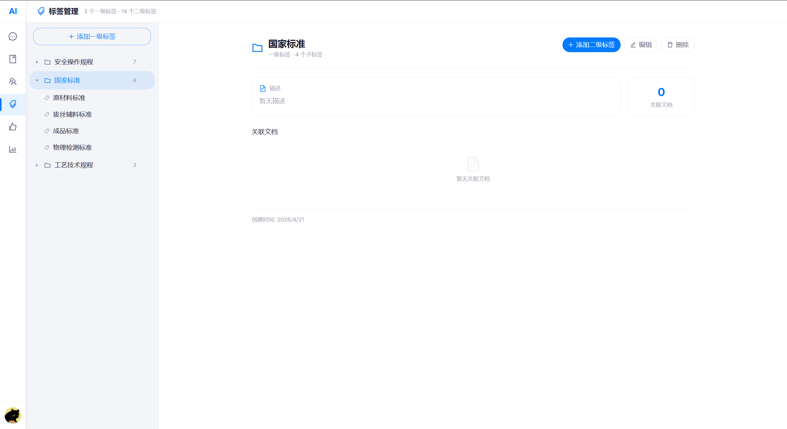</td>
    <td>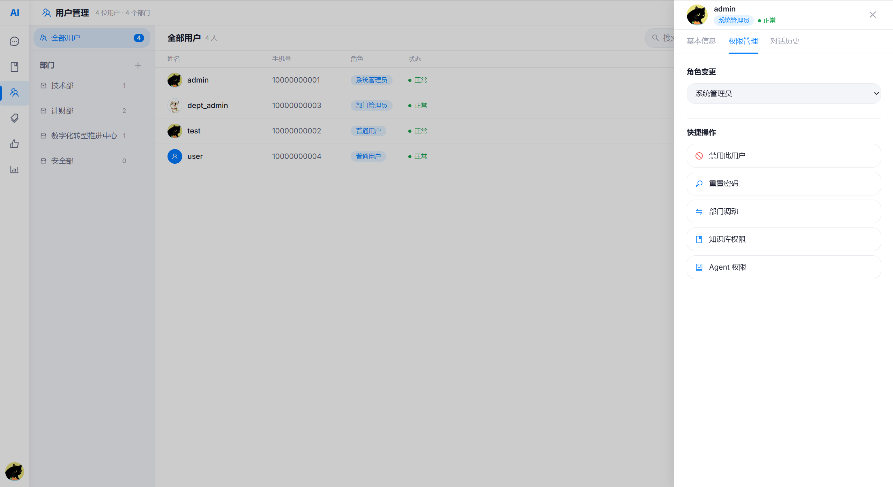</td>
  </tr>
  <tr>
    <td align="center"><b>反馈管理</b></td>
    <td align="center"><b>统计看板</b></td>
  </tr>
  <tr>
    <td>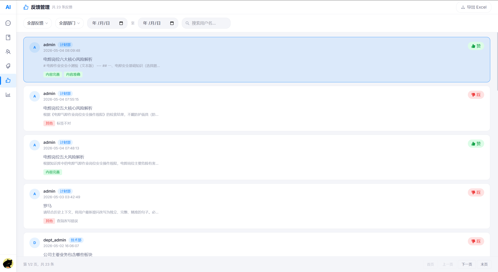</td>
    <td>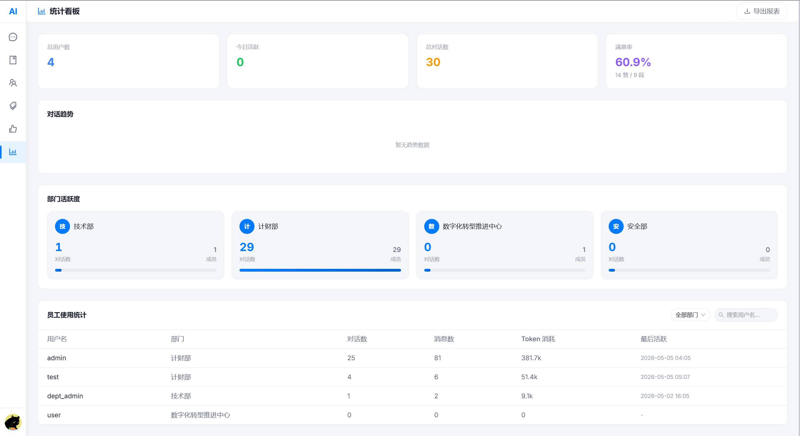</td>
  </tr>
  <tr>
    <td align="center"><b>AI 记忆管理</b></td>
    <td align="center"><b>深色模式</b></td>
  </tr>
  <tr>
    <td>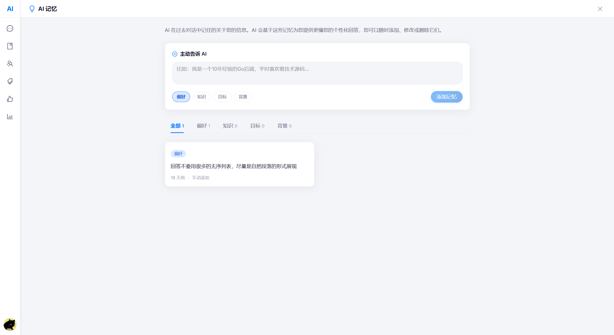</td>
    <td>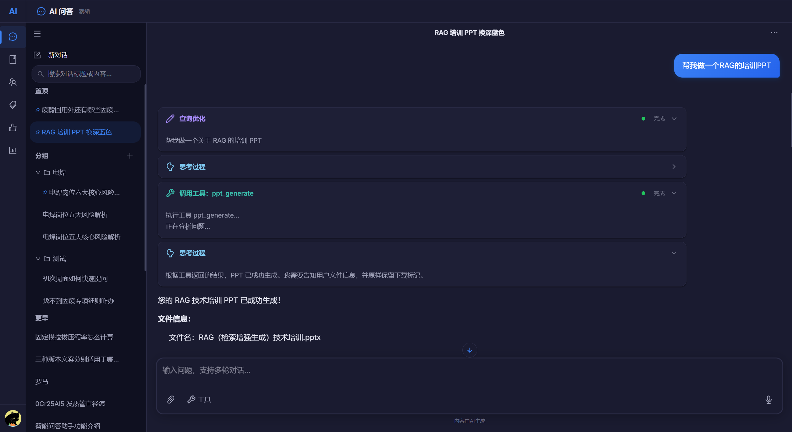</td>
  </tr>
</table>

## 系统架构

```
用户浏览器
    │
    ├─── SSE 流式 ───→ FastAPI (AI Service :7729) ───→ vLLM (Qwen3.5)
    │                        │                              │
    │                    LangGraph                      Elasticsearch
    │                   中间件链                            Redis
    │                        │
    └── REST API ───→ Django (Backend :8000)
                         │
                    MySQL · MinIO
```

**对话流程**：前端通过 SSE 直连 AI Service，JWT 通过 URL 参数认证。知识库访问权限由 Django 解析后注入 AgentState，ES 检索按 `kb_id` 过滤实现权限隔离。

**文档流程**：前端上传至 Django → Django 存储 MinIO + 写 DB → 触发 AI Service Celery 异步处理 → ES 建立索引。

## 快速开始

### 环境要求

- Python 3.12+
- Node.js 18+
- [uv](https://docs.astral.sh/uv/)（Python 包管理器）
- Docker & Docker Compose
- MySQL 8.0+
- vLLM（运行 Qwen3.5-9B）
- Elasticsearch 8.12+
- [MinerU](https://github.com/opendatalab/MinerU)（PDF 文档解析服务，PDF 文件上传所必需）
- [Ollama](https://github.com/ollama/ollama) + bge-m3 模型（文档向量化 Embedding）

### 1. 启动基础设施

```bash
docker-compose up -d
```

将启动 Redis、Elasticsearch、MinIO 三个服务。

### 2. 后端（Django）

```bash
cd backend
cp .env.example .env          # 编辑数据库、MinIO、JWT 密钥等配置
uv sync
uv run python manage.py migrate
uv run python manage.py createsuperuser
uv run python manage.py runserver 8000
```

### 3. AI 服务（FastAPI）

```bash
cd ai-service
cp .env.example .env          # 编辑 vLLM、ES、Redis、Django 回调地址等配置
uv sync

# 终端 1：API 服务
uv run python main.py

# 终端 2：Celery Worker（文档处理）
uv run python worker.py
```

### 4. 前端（React）

```bash
cd frontend
npm install
npm run dev
```

访问 http://localhost:5173 即可使用。

## 项目结构

```
├── backend/                  # Django 后端
│   ├── mybackend/            #   项目配置（settings、urls、CORS、JWT）
│   ├── users/                #   用户、部门、知识库权限模型
│   ├── chat/                 #   对话、消息、记忆、附件、反馈、AI 文件
│   ├── knowledge/            #   文档 CRUD + MinIO 上传 + 代理 AI Service
│   ├── tags/                 #   二级标签体系
│   ├── org/                  #   组织管理（用户/部门/权限/批量导入）
│   └── dashboard/            #   统计看板
│
├── ai-service/               # FastAPI AI 服务
│   ├── src/
│   │   ├── harness/          #   Agent 框架层（中间件链 + 工具注册 + LangGraph 图）
│   │   │   ├── tools/        #     es_search / file_parse / calculate / ppt_generate
│   │   │   ├── middlewares/  #     进度推送 / 死循环检测 / Token 追踪 / 记忆
│   │   │   ├── subgraphs/    #     复杂工具的 LangGraph 子图（搜索/计算）
│   │   │   ├── memory/       #     异步记忆（DjangoStorage + LLM 事实抽取）
│   │   │   └── nodes/        #     图节点：rewrite → agent ⇄ tools → maybe
│   │   └── app/              #   API 网关层（SSE 流式对话、文件上传）
│   ├── kb_service/           #   知识库索引服务（ES 映射 + Celery 文档处理流水线）
│   └── core/                 #   配置管理（pydantic-settings）
│
├── frontend/                 # React 前端
│   └── src/
│       ├── pages/            #   页面组件（Chat / Knowledge / Users / Tags / Dashboard ...）
│       ├── components/       #   通用组件（Layout / Chat / FilterSelect / GlobalDialogs）
│       ├── stores/           #   Zustand 状态管理（auth / chat / theme / layout / ui）
│       ├── api/              #   HTTP + SSE 层（Axios + fetch ReadableStream）
│       ├── hooks/            #   自定义 Hooks（useChatStream SSE 流式状态机）
│       └── utils/            #   工具函数（Markdown 渲染 + KaTeX + 相对时间）
│
├── docs/                     # 文档
└── docker-compose.yml        # 基础设施编排
```

## 配置说明

各服务通过 `.env` 文件管理配置（参考 `.env.example`）：

| 配置项 | 服务 | 说明 |
|--------|------|------|
| `VLLM_BASE_URL` | ai-service | vLLM 推理服务地址 |
| `DJANGO_API_BASE_URL` | ai-service | Django 后端地址（记忆系统、状态回调） |
| `AI_SERVICE_BASE_URL` | backend | AI Service 地址 |
| `ES_HOST` / `ES_PORT` | ai-service | Elasticsearch 连接 |
| `MINIO_ENDPOINT` | backend + ai-service | MinIO 对象存储地址 |
| `CELERY_BROKER` | ai-service | Redis Broker URL |
| `MINERU_API_URL` | ai-service | MinerU 文档解析服务地址（PDF 解析必需） |

## 代码规范

- **Python** — 类型注解（Python 3.12+ 语法）、Black + Ruff 格式化、导入排序（标准库 → 第三方 → 本地）
- **TypeScript** — `strict: true`、函数组件 + Hooks、Zustand 全局状态
- **架构边界** — `harness/` 禁止导入 `app/` 层，框架与网关严格分离
- **Git** — 提交信息使用中文

## 许可证

[MIT](LICENSE)
